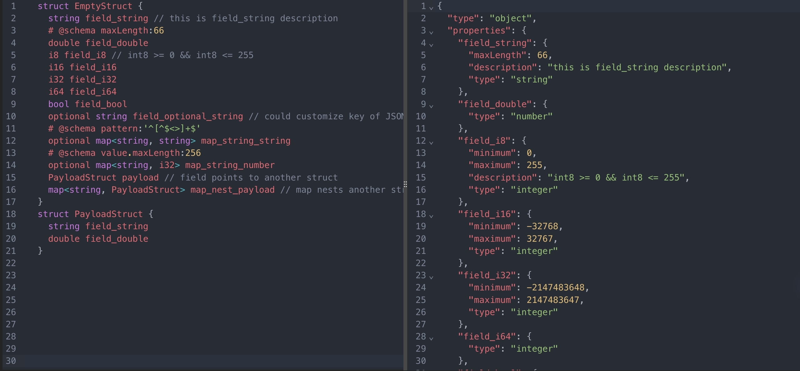

# overview
parse Thrift to JSON schema with typescript

# demo

[Online Demo](https://cjinhuo.github.io/thrift-to-json-schema/)

# install
`pnpm add @trasm/thrift-jsma`

# usage
```js
import { parseThriftToJsonSchema,parseThriftToTypeBox } from '@trasm/thrift-jsma'
  const structString = `
    # @flag header
    struct EmptyStruct {
    string field_string
    # @schema maxLength:66
    double field_double
    i32 field_i32
    i64 field_i64
    bool field_bool
    optional string field_optional_string
    }
  `
  const jsonSchema = parseThriftToJsonSchema(structString)
  const jsonTypeBox = parseThriftToTypeBox(structString)
```

## syntax
### flag
@flag header: means current struct is root node.
### scheme
@schema xxx: means add additional constraint for field, such as add '@schema maxLength:66' for string type

# references
* parse thrift to AST:https://github.com/creditkarma/thrift-parser
* built JSON schema with typescript:https://github.com/sinclairzx81/typebox


